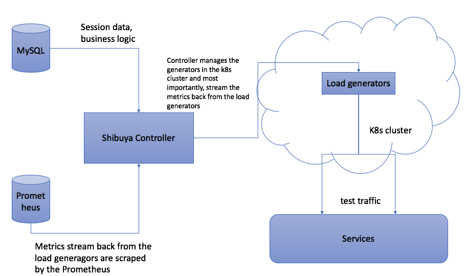

# Setup the dependencies

Shibuya relies on below components:

* shibuya-controller: The actual process that handles all the Shibuya business logic
* Kubernetes: Shibuya deploys all the load generators into a kubernetes cluster
* MySQL: all the session data and business logic
* Grafana: Metrics collected by Prometheus will be rendered at Grafana
* Prometheus: Metrics collected from the load generators will be scraped by Prom.

We will discuss each of this dependencies separately.

## Architecture Overview

## Shibuya-controller

We don't limit how you deploy the shibuya controller. The process it self is listening on 8080 port. Each shibuya controller is configured by a configuration file called `config.json`. We will discuss in details in the next section. [link](./config.md)

## Kubernetes

Current supported versions should work well with Shibuya.

Please follow below steps to setup the k8s cluster:

1. `kubect create ns shibuya-executors`

## MySQL

Internally, we are using fork of MySQL, MariaDB. But current versions of MySQL should work well with Shibuya.

All the schema files are stored under db folder. You just need to load the schemas into the database.

## Grafana

## Prometheus

